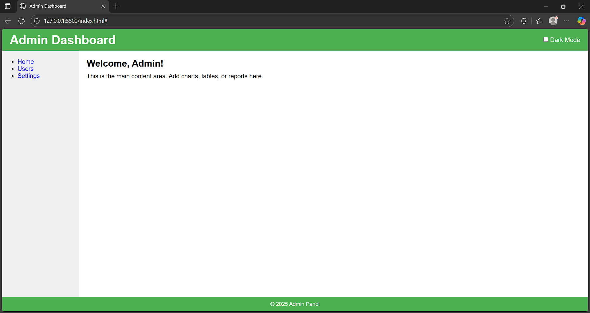

# 🛠️ Admin Dashboard (Responsive with Theme Switching)

This is a professional, responsive **Admin Dashboard** interface built using **HTML**, **CSS Grid**, and a **light/dark mode switcher**.

The layout is designed to be clean, minimal, and fully adaptable to different screen sizes. Theming is handled using CSS variables and toggled using JavaScript.

---

## 📸 Preview

---

## 🚀 Features

- ✅ **CSS Grid layout** for modern, responsive design
- 🌗 **Light and Dark Theme Toggle**
- 🖥️ Fully responsive for desktop and mobile
- 🎨 Clean and accessible UI
- ⚡ Fast loading (no external libraries used)

---

Made By Raghav Raina 23BCS10741
